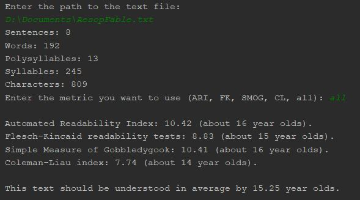

# Readability Score

Evaluates the readability of a text passage using the following popular metrics:
1. [Automated Readability Index (ARI)](https://en.wikipedia.org/wiki/Automated_readability_index)
2. [Flesch-Kincaid Readability Tests (FK)](https://en.wikipedia.org/wiki/Flesch%E2%80%93Kincaid_readability_tests)
3. [Simple Measure of Gobbledygook (SMOG)](https://en.wikipedia.org/wiki/SMOG)
4. [Coleman-Liau Index (CLI)](https://en.wikipedia.org/wiki/Coleman%E2%80%93Liau_index)

Completed as part of the **Hyperskill JetBrains Academy Java Developer Track**.

Difficulty: Medium

### Features
* Accepts a file path via the command line or during program execution
* Separate classes for metric evaluation and extraction of characteristics of the text (like words, sentences, syllables, etc.)

### Demonstration

The file path can simply be written without specifying any option as it is the only option available
After the text is parsed to determine the important characteristics required for metric evaluation, the user can choose which metric should be displayed or alternatively if all should be displayed.

### Dependencies

None; uses built-in Java libraries only

### Requirements

A fairly recent JDK

### Resources

* [Java Official Documentation](https://docs.oracle.com/javase/8/docs/)
* [GeeksForGeeks](https://www.geeksforgeeks.org/)
* [StackOverflow](https://stackoverflow.com/)

### To Do List

- [ ] Improve accuracy of the extraction of characteristics of the text
- [ ] Change to a GUI